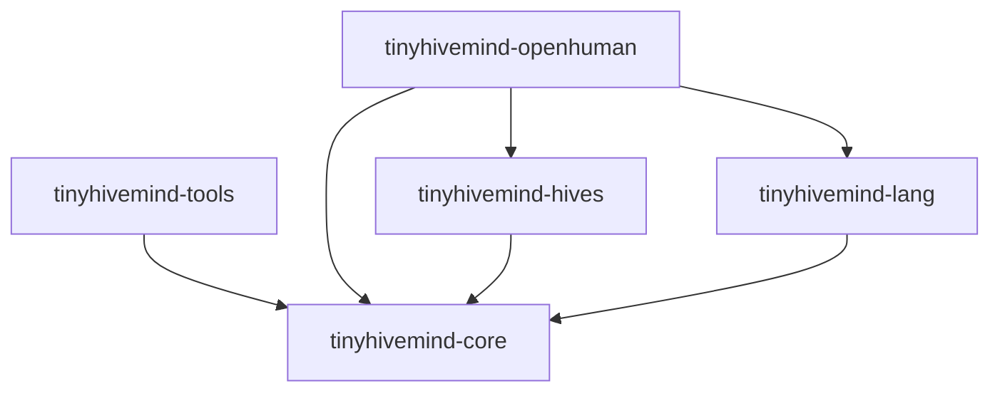

# How the crates use each other

The workspace has five crates. An arrow points from a dependent crate to the
crate it imports.

| Crate | Responsibility | External dependency boundary |
| --- | --- | --- |
| [core](../crates/tinyhivemind-core/README.md) | Grammar, session ports, hive folds, routing, TypeSafe System One, and completion driver | Host-supplied ports; no harness or transport |
| [tools](../crates/tinyhivemind-tools/README.md) | Episode call record and native `tinytools::ToolSpec` definitions | `tinytools` vocabulary |
| [hives](../crates/tinyhivemind-hives/README.md) | Durable inboxes, dynamic membership, serialized agent turns, conductor checkpoints | Replaceable storage; optional SQLite; no harness |
| [lang](../crates/tinyhivemind-lang/README.md) | Declarative packages, guarded edits, memory bindings and lineage | Pure serialization and hashing; no harness, store or transport |
| [OpenHuman](../crates/tinyhivemind-openhuman/README.md) | Permanent native tools and continuing turns on supplied handles | OpenHuman harness |

Core's `runtime`, `hive`, `embed`, `typesafe`, and `driver` modules are
namespaces within one Cargo package. Hosts can use the pure folds without
linking the OpenHuman adapter. Hosts can drive these ports directly, or use the
coordinator's storage and scheduler. The host constructs agents, controls their
sessions and credentials, and authorizes optional dynamic management.
